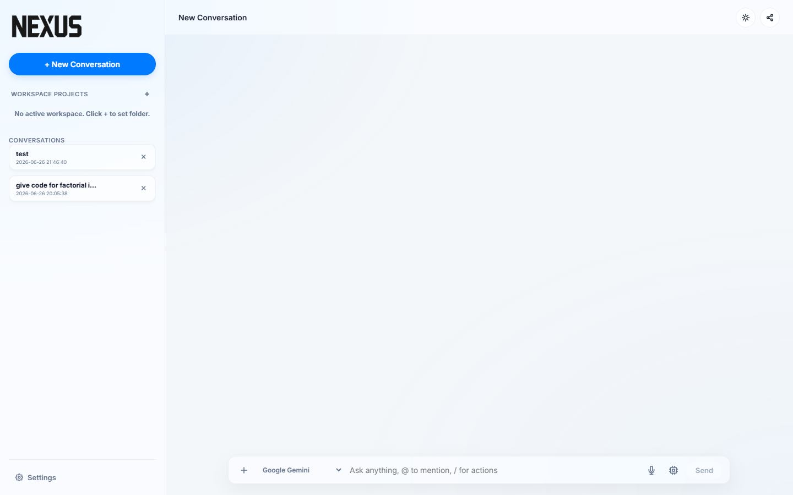
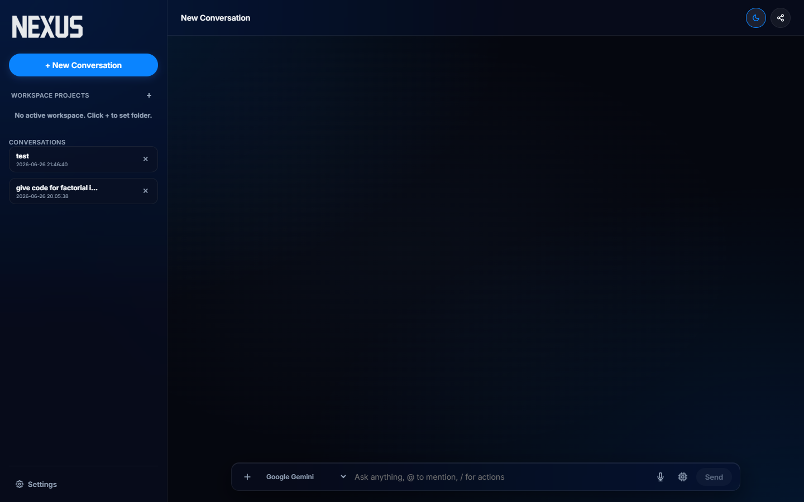
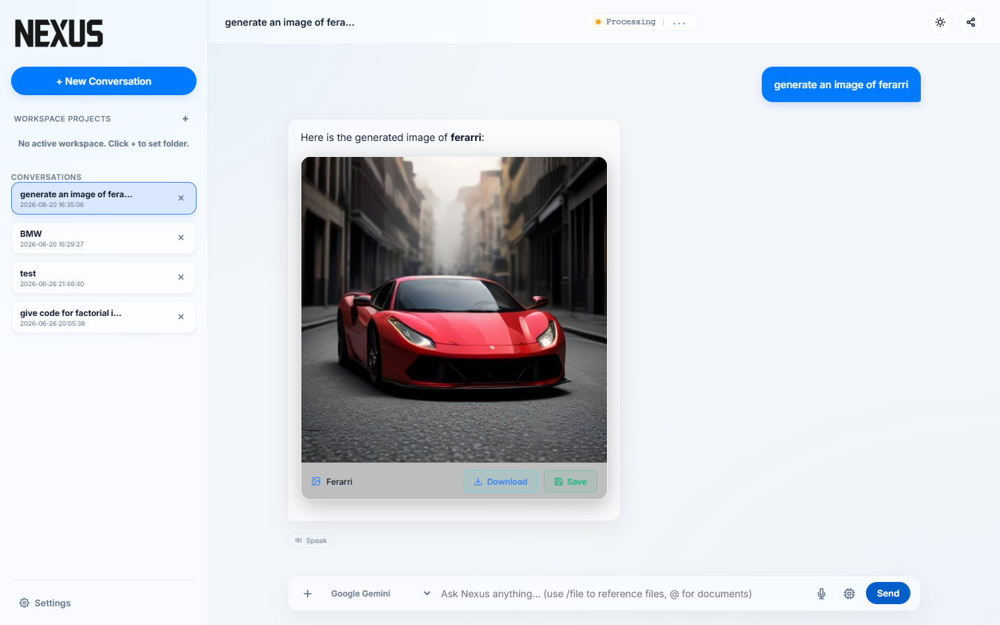
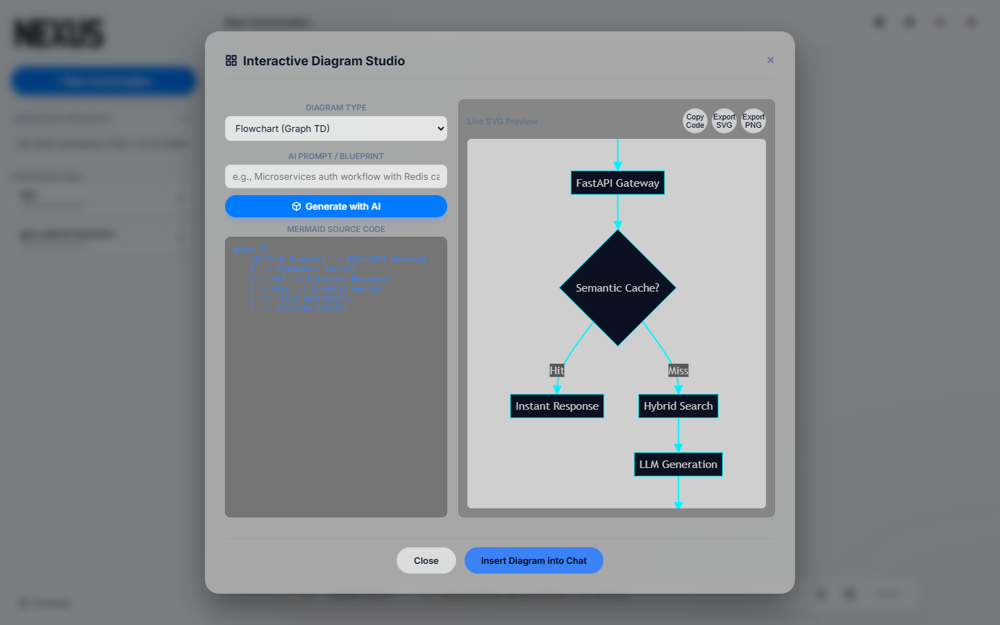
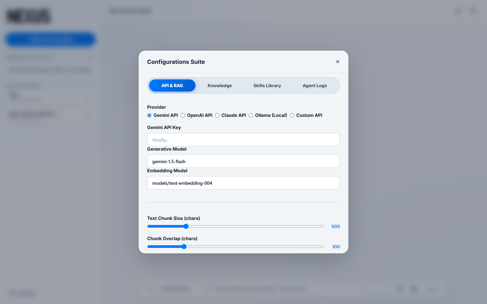
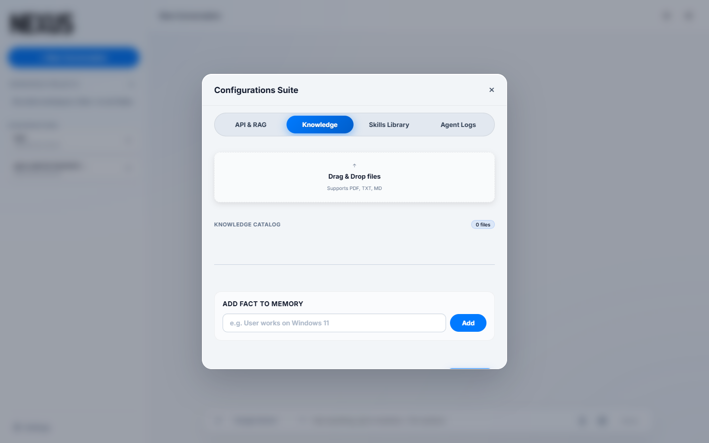
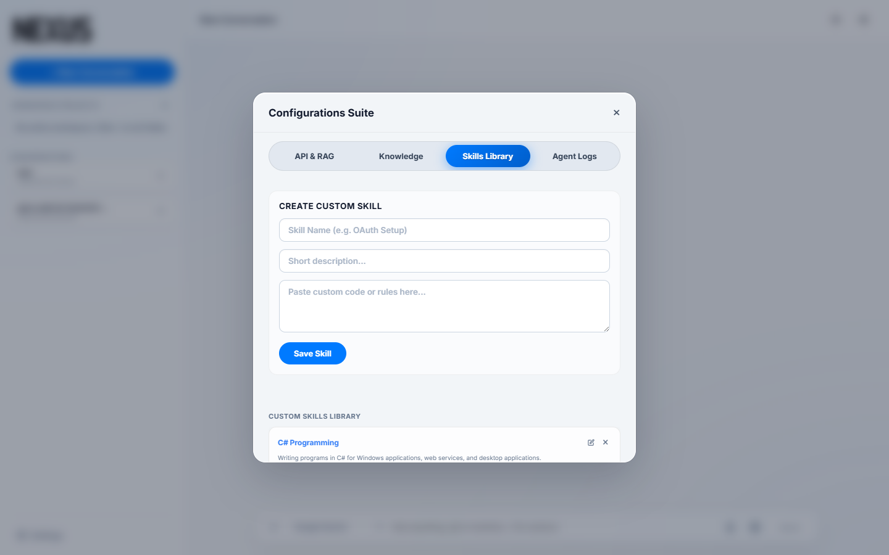
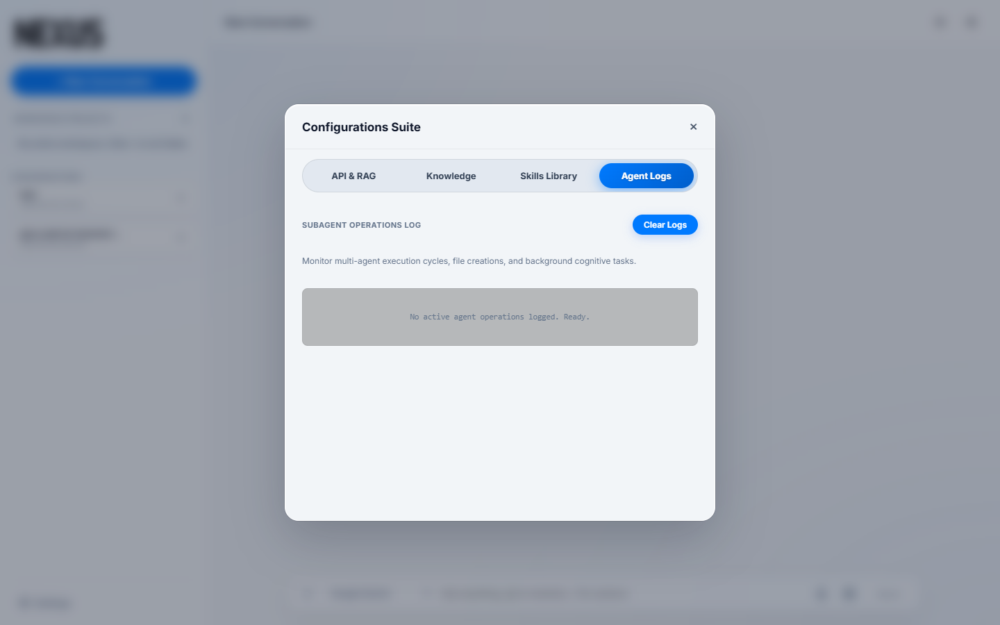

# Nexus Cognitive RAG Engine

[](https://fastapi.tiangolo.com/)
[](https://www.python.org/)
[](https://www.sqlite.org/)
[](https://mermaid.js.org/)
[](https://pollinations.ai/)
[](LICENSE)

**Nexus** is an enterprise-grade, ultra-high-performance RAG (Retrieval-Augmented Generation) cognitive assistant and developer workstation. Powered by a unified **Spatial Glassmorphism Interface**, Nexus delivers real-time document retrieval, in-chat interactive Mermaid diagram generation, instant FLUX.1 image creation, multi-provider LLM orchestration, and seamless local workspace code execution.

---

## 📽️ Visual Walkthrough & Interface Gallery

### 🖥️ Workspace Overview (Dark & Light Themes)

| 🌙 Midnight Dark Mode | ☀️ Clean Studio Light Mode |
|:---:|:---:|
|  |  |

---

### 🎨 In-Chat AI Image & Diagram Generators

| 🖼️ In-Chat AI Image Generation | 📊 Interactive Mermaid SVG Diagrams |
|:---:|:---:|
|  |  |

---

### ⚙️ Configurations Suite & Control Panels

| 🔌 Multi-Provider API & RAG Settings | 📚 Knowledge Catalog & Episodic Memory |
|:---:|:---:|
|  |  |

| ⚡ Custom Skills Library | 🤖 Subagent Operations Logger |
|:---:|:---:|
|  |  |

---

## ✨ Core Features & Capabilities

### 🎨 In-Chat Diagram & Image Generator
* **Automatic Diagram Generation (Mermaid.js SVG)**:
  * Simply ask in chat (*"Draw a flowchart of auth flow"*, *"Generate a sequence diagram for RAG"*, *"Create a class diagram"*).
  * Automatically renders interactive SVG diagrams with **Copy Code**, **Export SVG**, and **Export PNG** download buttons.
* **Automatic High-Resolution AI Image Generation (FLUX.1)**:
  * Simply ask in chat (*"Generate an image of a futuristic supercar"*, *"Draw a picture of a cyberpunk hacker desk"*).
  * Renders interactive image showcase cards with **1-Click Download**, **Save File to Workspace**, and **Full-Resolution Lightbox**.

### 🧠 Advanced RAG & Vector Retrieval Engine
* **Multi-Provider LLM Switcher**: Connect to Google Gemini, OpenAI (GPT-4o), Anthropic Claude, NVIDIA NIM (`integrate.api.nvidia.com`), Groq, and Local Ollama.
* **Hybrid Search (Vector Cosine + BM25 Lexical)**: Reciprocal Rank Fusion (RRF) combining dense semantic embeddings and keyword matching.
* **HyDE (Hypothetical Document Embeddings)**: Expands query vectors with hypothetical context chunks to maximize retrieval accuracy.
* **Semantic Query Caching**: Returns instant responses for duplicate or near-duplicate queries ($\ge 96\%$ similarity) in **under 50ms**.
* **Sibling Context Enrichment**: Automatically enriches retrieved document chunks with surrounding paragraphs for full context comprehension.

### 🤖 Autonomous Multi-Agent Team Loop
* **4-Turn Multi-Agent Coordination**:
  * 🔍 **Researcher Agent**: Analyzes request, performs web searches, and drafts implementation blueprint.
  * 💻 **Developer Agent**: Writes and refines code files in sandbox.
  * 🛡️ **Critic / Auditor Agent**: Runs security checks and validates output.
  * ⚡ **Finalizer**: Produces production-ready response.

### 💻 Developer Productivity Suite
* **Interactive Code Sandbox**: Executes Python and JavaScript code snippets in an isolated local sandbox with a 5-second safeguard timeout.
* **Code Diff Modal**: Side-by-side green/red LCS diff viewer before saving modified files to the active workspace.
* **Audio Voice Engine**: Speech-to-Text voice query transcription & Neural Text-to-Speech playback.

---

## 🚀 Quick Start & Installation

Nexus includes automated one-click startup scripts that handle virtual environment setup, package installation, and server launching automatically.

### Windows (PowerShell)
Right-click `run.ps1` and select **Run with PowerShell**, or execute:
```powershell
./run.ps1
```

### Windows (Command Prompt)
Double-click `Nexus.bat` to launch immediately.

The startup script will automatically:
1. Initialize a Python virtual environment (`venv`).
2. Install all required dependencies from `requirements.txt`.
3. Launch the FastAPI Uvicorn engine on `http://127.0.0.1:8000`.

---

## 🛠️ Technology Stack

* **Backend**: Python 3.9+, FastAPI, Uvicorn, SQLite Vector Engine, HTTPX
* **Frontend**: HTML5, Vanilla JavaScript (ES6+), Modern CSS3 Glassmorphism
* **Generative Visuals**: Mermaid.js v10 (SVG Diagrams), Pollinations AI / FLUX.1 (Image Generation)
* **Syntax & Math Rendering**: Prism.js (Midnight Syntax), KaTeX (LaTeX Math)

---

## 📄 License

Distributed under the MIT License. Built for local cognitive AI workflows.
